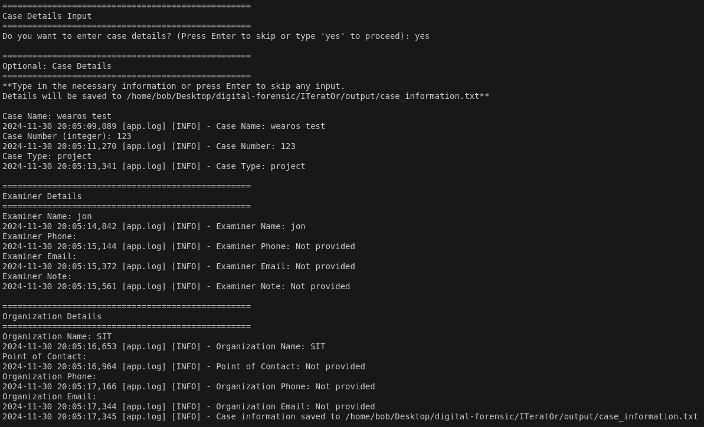
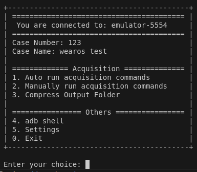
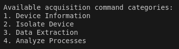
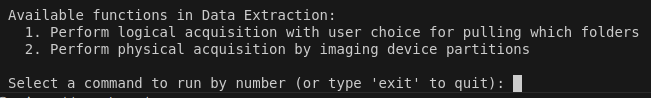
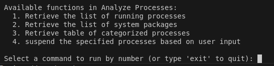

# ITeratOr Forensic Tool Setup Guide

This guide will help you set up and run ITeratOr for digital forensics tasks, especially focused on WearOS devices.

## Requirements

Before starting the acquisition, ensure you have the following devices and setup:

- **1x Linux Instance**: The platform where the tool will be installed.
- **1x Physical or Logical WearOS Watch**: The device to be analyzed.

<div style="border-left: 5px solid #2196F3; padding: 10px; margin: 10px 0;">
    <strong>Note:</strong>  
    The tool has been tested on <strong>API34 (emulated)</strong> and <strong>API33 (physical)</strong> devices, but it should work with other versions as well.
</div>

---

## Table of Contents

1. [Getting Started](#getting-started)
2. [Setting Up the Android Environment](#setting-up-android-environment)
3. [Wireless Debugging Setup](#wireless-debugging-setup)
4. [Faking Package / Process](#faking-package-process)
5. [When Developing](#when-developing)
6. [Log Files](#log-files)

<br/>

# Getting Started (Linux Machine)
1. Run a Linux Virtual Environment with 'Virtualize Intel VT-x/EPT or AMD-V/RVI' enabled.
    
    https://www.reddit.com/r/vmware/comments/k7hd4z/virtualized_amdvrvi_is_not_supported_on_this/

2. Clone the repository
    ```
    git clone https://github.com/jonnnnn-c/digital-forensic.git
    ```

3. Download requirements.txt
    ```
    pip install -r requirements.txt
    ```

4. Setup GENAPI key for suspend process function (OPTIONAL)
    
    **https://aistudio.google.com/app/apikey**
    
    - Sign in to your google account
    - Click "Create API key"
    - Click "Create API key in new project"
    - Copy api key and put it `settings.py` file, under `GENAI_API_KEY`

5. Start app
    ```
    usage: main.py [-h] (-p | -e) [-i INTERFACE] [--clear-logs]

    Choose between physical or emulated watch connection.

    options:
    -h, --help            show this help message and exit
    -p, --physical        Use physical watch
    -e, --emulated        Use emulated watch
    -i INTERFACE, --interface INTERFACE
                          Specify network interface for physical watch (default is wlan0)
    --clear-logs          Clear all log files in the output folder
    ```

<p align="right">(<a href="#readme-top">back to top</a>)</p>

# Setting up Android Environment
1. Create emulators in Android Studio:
- `x1 Android phone` (e.g., Medium Phone, VanillaIceCream)
- `x1 WearOS watch` (e.g., Wear OS Large Round, UpsideDownCake)
- <b>Note:</b> Use images in <b>"recommended</b> section for the phone if not you would not be able to pair with the watch

2. Start up the watch using the following command:
    ```
    emulator -avd <AVD_NAME e.g., Wear_OS_Large_Round_API_34> -writable-system
    ```

3. In another terminal, perform the following command:
    ```
    # elevated privileges (root) to aid with app troubleshooting
    adb root

    # enable writable system
    adb remount
    
    # after remount need reboot
    adb reboot
    ```

4. In another terminal, start up the phone with the same command previously mentioned (step 2)

5. Setup all the necessary information needed on both devices for simulation.

6. Next, setup a snapshot so it's easier to do testing. Stop the phone.

7. Perform the following commands for the watch to save a snapshot of its current state.
    ```
    # will always take the single current running AVD instance, cannot specify which one
    adb emu avd snapshot save <SNAPSHOT_NAME e.g. snap_1>

    # checking if snapshot is loadable
    emulator -avd Pixel_8_Pro_API_34 -check-snapshot-loadable <SNAPSHOT_NAME e.g. snap_1>
    ```
8. To load the device with its snapshot:
    ```
    # Start from snapshot
    emulator -avd <AVD_NAME> -writable-system -snapshot <SNAPSHOT_NAME e.g. snap_1>
    ```

<p align="right">(<a href="#readme-top">back to top</a>)</p>

# Setup Wireless Debugging (on Physical & Emulated) 
- Enable Developer Mode
    ```
    Settings > System > About > Versions > Build Number (press 7 times)
    ```
- Enable Wireless Debugging
    ```
    Settings > Developer options > Wireless debugging 
    ```

<p align="right">(<a href="#readme-top">back to top</a>)</p>

# Faking Package / Process
You can choose one of the following methods to simulate a running package or process on a WearOS device:

## 1. Running a Background Process in ADB Shell
To create a simple infinite loop that outputs a message, use the following command in the ADB shell:

```
adb shell "while true; do echo 'Fake process running'; sleep 60; done" &
```
This command will continuously print "Fake process running" every 60 seconds, allowing you to simulate a background process effectively.

## 2. Setting Up a Fake App
To create a fake app that mimics legitimate behavior on your WearOS device, follow these steps:

1. <b>Create an Empty Wear App in Android Studio:</b>

    - Start a new project in Android Studio and select "Wear OS" as the application type.

2. <b>Modify the App Details:</b>

    - Name: Set the app name to fakewearos (or a name of your choice).
    - Package Name: Change the package name to com.google.fakewearos.
        - This choice helps the app blend in with existing packages, making it appear more legitimate compared to the default package name com.example.fakewearos.

3. <b>Rename the Package (if needed):</b>
    - If you need to rename the package again, refer to this helpful guide: Rename Package in Android Studio.

## 3. Installing an App from the Google Play Store on the Watch
To install apps directly from the Google Play Store on your WearOS watch, follow these steps:

1. <b>Pair Your Watch with a Phone:</b>

    - Use Android Studio to ensure your WearOS watch is properly paired with an Android phone.

2. <b>Sign In to Your Google Account:</b>

    - On your watch, sign in with your Google account. This process will prompt you to continue on your phone for verification.

3. <b>Download Apps from the Watch:</b>

    - Once your account is set up, you can browse and download any compatible apps directly from the Google Play Store on your watch.

<p align="right">(<a href="#readme-top">back to top</a>)</p>

# Log files

While developing:
- Separate everything into folders and functions to make development easier
- Use the logger.info or logger command to note each critical setp or command used during script execution
    - https://docs.python.org/3/howto/logging.html

- The following log files, located in the 'output' folder, provide useful information about what happened when the tool ran. It captures critical details about the activities that took place during its execution, allowing us to better understand what happened at each stage.

| **Log File**           | **Description**                                                                                                   |
|------------------------|-------------------------------------------------------------------------------------------------------------------|
| `app.log`              | Tracks general application activity, such as user menu selections and tool interactions.                          |
| `env_setup.log`        | Records the setup process, verifying that necessary environments like ADB are properly configured.                |
| `network.log`          | Logs connectivity-related events, including device connections, disconnections, and network security checks.      |
| `acquisition.log`      | Captures key actions during information gathering, data acquisition, process suspensions, and related activities. |
| `compress.log`         | Details the outcomes of compression actions, including errors and successful operations.                          |

<p align="right">(<a href="#readme-top">back to top</a>)</p>

# Screenshots

1. Case Information:
    
    

2. Menu:
    
    

3. Available Manual Options:
    
    

4. Device Information:
    
    

5. Isolate Device:
    
    

6. Data Acquisition:
    
    

7. Processes:
    
    

<p align="right">(<a href="#readme-top">back to top</a>)</p>