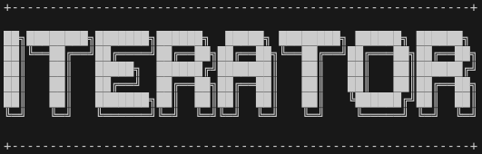
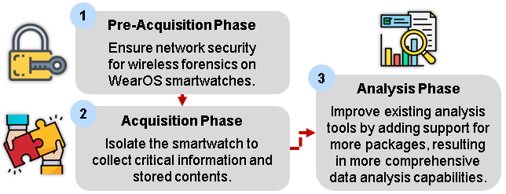

<h1 align="center">
  <br>
  <a href="https://github.com/jonnnnn-c/ITeratOr-WearOS/">
    
  </a>
</h1>

<div align="center">
  <h3>A Gateway to Secure WearOS Forensics</h3>
  
  <!-- Shields section -->
  <div>
    
    
    
    <br/>
    
    
    <a href="https://opensource.org/licenses/MIT">
      
    </a>
  </div>
</div>

<br/>

<p align="right">(<a href="#readme-top">back to top</a>)</p>

# 🎬 Introduction
Smartwatches have grown in popularity because of fitness trends and technological advancements, with WearOS devices standing out for their growth and widespread adoption. These devices collect sensitive data, such as health metrics and messages, while allowing for seamless device communication. However, their extensive data exchange makes them prime targets for malicious actors, emphasizing the importance of specialized forensic tools in this expanding market.

<p align="right">(<a href="#readme-top">back to top</a>)</p>

# 💡 Our Project

<table>
<tr>
<td>

**ITeratOr** aim is to provide a secure and efficient wireless digital forensics process, while also expanding on current analysis capabilities for deeper insights.



Our project consists of three phases: pre-acquisition, acquisition, and analysis. ITeratOr, our tool, manages the pre-acquisition and acquisition stages, while the analysis phase aims to enhance existing ALEAPP technology (https://github.com/abrignoni/ALEAPP).

</td>
</tr>
</table>

<p align="right">(<a href="#readme-top">back to top</a>)</p>

# 🚦 Getting Started
The repository is divided into two sections: **ITeratOr** and **ALEAPP**. To learn how to run each, refer to the respective `README.md` files located in their corresponding folders. 
- [**ITeratOr**](/ITeratOr/README.md): Contains code for the pre-acquisition and acquisition phases
- [**ALEAPP**](/ALEAPP/README%20copy.md): Contains code for the analysis phase

```
cd ITeratOr # or
cd ALEAPP
```

<p align="right">(<a href="#readme-top">back to top</a>)</p>

# 😴 Contributors
This project is a collaborative effort undertaken by students from the Singapore Institute of Technology (SIT)

<a href="https://github.com/jonnnnn-c/ITeratOr-WearOS/graphs/contributors">
  
</a>

<p align="right">(<a href="#readme-top">back to top</a>)</p>